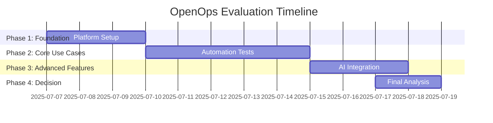

# OpenOps Integration Evaluation - Executive Overview

## Business Value Proposition

**Objective**: Evaluate OpenOps vs Archera for FinOps automation  
**Timeline**: 14 days (July 7-18, 2025)  
**Expected ROI**: 15-30% cost savings  
**Decision Point**: Go/No-Go by July 18, 2025

## Executive Summary

Evaluate OpenOps open-source platform as potential replacement for Archera. Two-week pilot will assess automation capabilities, integration complexity, and cost optimization potential to inform strategic FinOps platform decision.

### Evaluation Criteria

| Metric | OpenOps Target | Archera Baseline |
|--------|----------------|------------------|
| **Cost Reduction** | 15-30% | Current performance |
| **Automation Coverage** | >80% use cases | Manual processes |
| **Integration Complexity** | Medium | Established |
| **Platform Cost** | $0 (open source) | Licensing fees |

## Evaluation Timeline

## Expected Outcomes

### OpenOps Advantages
- **Zero Licensing Cost**: Open source vs paid Archera
- **AWS Native**: Better integration with AWS services
- **Customization**: Full control over automation workflows
- **AI Integration**: AWS Bedrock for intelligent optimization

### Evaluation Deliverables
- Comparative analysis report
- ROI projection and cost-benefit analysis
- Technical feasibility assessment
- Implementation roadmap (if approved)

## Investment Analysis

**Evaluation Cost**: Team time only (14 days)  
**OpenOps Platform**: $0 (open source)  
**Potential Savings**: 15-30% of monthly AWS spend  
**Archera Alternative**: Ongoing licensing costs

### Decision Factors
- Technical capability comparison
- Integration complexity assessment
- Long-term cost implications
- Team adoption feasibility

## Use Cases Being Evaluated

### Priority Use Cases (Phase 2)
- **Idle EC2 Detection**: Automated shutdown of unused instances
- **EBS Volume Cleanup**: Remove unattached storage volumes
- **Cost Threshold Alerts**: Proactive spending notifications
- **Resource Tagging**: Automated compliance enforcement
- **S3 Security**: Public bucket remediation

### Advanced Features (Phase 3)
- **AI-Powered Rightsizing**: AWS Bedrock integration
- **ITSM Integration**: Jira workflow automation
- **Approval Workflows**: Slack-based approvals

## Technical Architecture

### Current State (Archera)
- Established FinOps platform
- Manual processes for optimization
- Limited automation capabilities
- Ongoing licensing costs

### Target State (OpenOps)
- Event-driven automation workflows
- AWS native integrations
- AI-powered optimization
- Open source flexibility

## Risk Assessment

| Risk | Probability | Impact | Mitigation |
|------|-------------|--------|-----------|
| **OpenOps Deployment Issues** | Medium | High | Backup deployment method |
| **Integration Complexity** | Medium | Medium | Phased implementation |
| **Team Adoption** | Low | Medium | Training and documentation |
| **Performance Issues** | Low | Low | Monitoring and optimization |

## Technology Stack

### OpenOps Platform
- **Core Platform**: Open source automation engine
- **AWS Integration**: Native service connectivity
- **Policy Engine**: Rule-based automation
- **Workflow Builder**: Visual automation designer

### Integration Points
- **AWS Services**: EC2, EBS, S3, CloudWatch, Cost Explorer
- **External Tools**: Slack, Jira, GitHub
- **AI Services**: AWS Bedrock for intelligent optimization
- **Infrastructure**: Terraform automation templates

## Success Criteria

### Technical Success
- [ ] 20 use cases successfully implemented
- [ ] <5 minute average remediation time
- [ ] 95% notification delivery success
- [ ] All integrations functional

### Business Success
- [ ] Positive ROI vs Archera comparison
- [ ] Clear implementation roadmap
- [ ] Team confidence in platform
- [ ] Leadership approval for adoption

## Project Team

### Core Team
- **Muhammad Waleed**: Project Manager, coordination and reporting
- **Glenn Gray**: Solutions Architect, technical leadership
- **Anas Ahmed**: DevOps Engineer, platform implementation
- **Hamza Sarwar**: Cloud Engineer, integration and workflows

### Decision Makers
- **Chris**: Leadership stakeholder
- **Cossam**: Leadership stakeholder

---

**Next Steps**: [Technical Implementation](README_tech.md) | [Project Plan](project-plan.md) | [Architecture Design](../docs/openops-architecture.md)