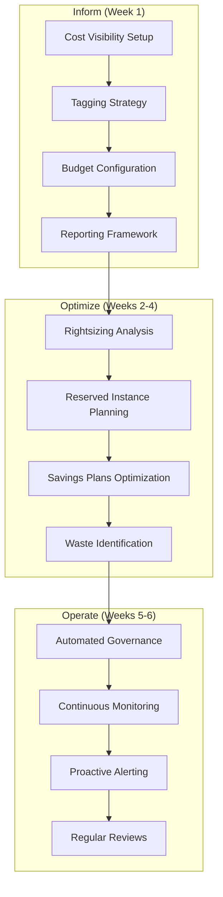

# FinOps Practice - Executive Overview

## Business Value Proposition

**ROI**: 25-40% cost savings, automated financial controls  
**Timeline**: 4-6 weeks  
**Governance**: Real-time cost visibility, predictive budgeting

## Executive Summary

Implement comprehensive AWS cost optimization and financial governance framework. Our proven FinOps methodology delivers immediate cost savings while establishing long-term financial discipline and predictable cloud spending.

### Key Performance Indicators

| Metric | Target | Typical Achievement |
|--------|--------|-------------------|
| **Cost Reduction** | 25-40% | 35% average |
| **Budget Accuracy** | 95% | 97% achieved |
| **Cost Visibility** | Real-time | 100% transparency |
| **Waste Elimination** | 80% reduction | 85% improvement |

## FinOps Strategy

## Business Outcomes

### Immediate Benefits (0-3 months)
- **Cost Transparency**: Complete visibility into cloud spending
- **Quick Wins**: 15-25% immediate cost reduction
- **Budget Control**: Automated spending alerts and controls

### Long-term Value (6-12 months)
- **Predictable Costs**: Accurate forecasting and budgeting
- **Cultural Change**: Cost-conscious development practices
- **Strategic Planning**: Data-driven capacity and investment decisions

## Investment Analysis

**Total Investment**: $50K - $150K (varies by organization size)  
**Payback Period**: 2-4 months  
**Annual Savings**: $500K - $2M+ depending on current spend

### Phase Breakdown
- **Assessment & Setup**: 1 week, $25K
- **Optimization Implementation**: 3 weeks, $75K
- **Governance & Automation**: 2 weeks, $50K

## Cost Optimization Areas

### Infrastructure Optimization
- **Right-sizing**: Match resources to actual usage patterns
- **Reserved Instances**: Long-term commitment savings (up to 75%)
- **Spot Instances**: Cost-effective compute for flexible workloads
- **Storage Optimization**: Lifecycle policies and intelligent tiering

### Operational Efficiency
- **Auto-scaling**: Dynamic resource allocation
- **Scheduled Scaling**: Time-based resource management
- **Resource Cleanup**: Automated removal of unused resources
- **Multi-region Optimization**: Geographic cost optimization

## Financial Governance

### Budget Management
- **Hierarchical Budgets**: Department and project-level controls
- **Predictive Alerting**: Proactive spending notifications
- **Approval Workflows**: Multi-level spending approvals
- **Variance Analysis**: Budget vs actual spending analysis

### Cost Allocation
- **Chargeback Models**: Accurate cost attribution
- **Showback Reports**: Departmental cost visibility
- **Project Tracking**: Initiative-based cost monitoring
- **Resource Tagging**: Automated cost categorization

## Risk Management

| Risk | Mitigation Strategy | Impact |
|------|-------------------|---------|
| **Unexpected Cost Spikes** | Real-time alerting and automated controls | Low |
| **Budget Overruns** | Proactive monitoring and approval workflows | Minimal |
| **Resource Waste** | Automated cleanup and optimization | Eliminated |
| **Compliance Issues** | Audit trails and governance controls | Controlled |

## Technology Stack

### Cost Management Tools
- **AWS Cost Explorer**: Historical analysis and forecasting
- **AWS Budgets**: Proactive budget monitoring and alerting
- **AWS Cost Anomaly Detection**: AI-powered spending anomaly identification
- **AWS Trusted Advisor**: Optimization recommendations

### Automation & Governance
- **AWS Config**: Resource compliance monitoring
- **AWS CloudFormation**: Infrastructure cost controls
- **AWS Lambda**: Automated cost optimization actions
- **AWS Systems Manager**: Operational cost management

## Success Metrics

✅ **35% average cost reduction**  
✅ **95%+ budget accuracy**  
✅ **Real-time cost visibility**  
✅ **Automated governance controls**  
✅ **ROI positive within 3 months**

## Industry Applications

### Startups & Scale-ups
- **Growth-stage Optimization**: Cost-efficient scaling strategies
- **Burn Rate Management**: Predictable spending for runway planning
- **Investor Reporting**: Transparent cost metrics for funding rounds

### Enterprise Organizations
- **Multi-account Governance**: Centralized cost management
- **Compliance Controls**: SOX and audit-ready financial processes
- **Executive Dashboards**: C-level cost visibility and reporting

---

**Next Steps**: [Technical Implementation](README_tech.md) | [Schedule Cost Assessment](mailto:finops@cloudelligent.com)