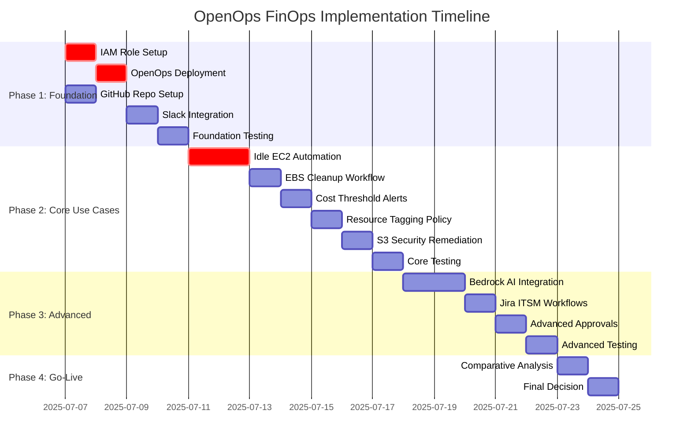

# Cloudelligent-Production FinOps Practice - Project Plan

**Project:** OpenOps Integration for FinOps Automation  
**Account:** 052236698216 (us-east-1)  
**Duration:** 14 days (July 7-18, 2025)  
**Budget:** $0 (Open Source + AWS resources)  

## 1. Project Phases and Milestones

### Phase 1: Foundation Setup (Days 1-3)
**Milestone:** Infrastructure Ready  
**Success Criteria:** All integrations tested, IAM configured, team access established

### Phase 2: Core Use Cases (Days 4-8) 
**Milestone:** Priority Automations Live  
**Success Criteria:** 5 high-impact use cases deployed and validated

### Phase 3: Advanced Features (Days 9-12)
**Milestone:** AI & ITSM Integration Complete  
**Success Criteria:** Bedrock AI, Jira workflows, advanced approvals functional

### Phase 4: Evaluation & Go-Live (Days 13-14)
**Milestone:** Production Ready  
**Success Criteria:** Comparative analysis complete, go/no-go decision made

## 2. Task Breakdown with Dependencies

### Gantt Chart Visualization

### Detailed Task Dependencies

| Task ID | Task Name | Duration | Dependencies | Owner | Priority |
|---------|-----------|----------|--------------|-------|----------|
| **Phase 1: Foundation** |
| F1.1 | IAM Role Configuration | 1d | - | Anas | Critical |
| F1.2 | OpenOps Platform Deploy | 1d | F1.1 | Anas | Critical |
| F1.3 | GitHub Repository Setup | 1d | - | Hamza | High |
| F1.4 | Slack Webhook Integration | 1d | F1.2 | Anas | High |
| F1.5 | Foundation Testing | 1d | F1.2, F1.4 | Team | Critical |
| **Phase 2: Core Use Cases** |
| C2.1 | Idle EC2 Detection/Shutdown | 2d | F1.5 | Anas | Critical |
| C2.2 | EBS Volume Cleanup | 1d | C2.1 | Anas | Critical |
| C2.3 | Cost Threshold Alerting | 1d | C2.2 | Hamza | High |
| C2.4 | Resource Tagging Automation | 1d | C2.3 | Hamza | High |
| C2.5 | S3 Security Remediation | 1d | C2.4 | Anas | Medium |
| C2.6 | Core Use Case Testing | 1d | C2.5 | Team | Critical |
| **Phase 3: Advanced Features** |
| A3.1 | AWS Bedrock AI Integration | 2d | C2.6 | Glenn | Medium |
| A3.2 | Jira ITSM Workflow Setup | 1d | A3.1 | Hamza | Medium |
| A3.3 | Advanced Approval Workflows | 1d | A3.2 | Anas | Low |
| A3.4 | Advanced Feature Testing | 1d | A3.3 | Team | High |
| **Phase 4: Evaluation** |
| E4.1 | OpenOps vs Archera Analysis | 1d | A3.4 | Glenn | Critical |
| E4.2 | Go/No-Go Decision | 1d | E4.1 | Leadership | Critical |

## 3. Resource Allocation by Phase

### Team Structure
| Role | Name | Allocation | Primary Responsibilities |
|------|------|------------|-------------------------|
| **Project Manager** | Muhammad Waleed | 25% | Coordination, reporting, stakeholder management |
| **Solutions Architect** | Glenn Gray | 50% | Architecture, analysis, decision support |
| **DevOps Engineer** | Anas Ahmed | 100% | Implementation, deployment, testing |
| **Cloud Engineer** | Hamza Sarwar | 75% | Integration, documentation, workflows |

### Phase-Specific Allocation

#### Phase 1 (Days 1-3): Foundation
- **Anas Ahmed:** 100% - Platform deployment, IAM setup
- **Hamza Sarwar:** 50% - Repository setup, documentation
- **Glenn Gray:** 25% - Architecture review, guidance
- **Muhammad Waleed:** 25% - Coordination, stakeholder updates

#### Phase 2 (Days 4-8): Core Implementation  
- **Anas Ahmed:** 100% - Use case implementation, testing
- **Hamza Sarwar:** 100% - Workflow configuration, validation
- **Glenn Gray:** 50% - Technical guidance, review
- **Muhammad Waleed:** 25% - Progress tracking, reporting

#### Phase 3 (Days 9-12): Advanced Features
- **Glenn Gray:** 75% - AI integration, complex workflows
- **Anas Ahmed:** 75% - Advanced automation, testing
- **Hamza Sarwar:** 75% - ITSM integration, approvals
- **Muhammad Waleed:** 50% - Stakeholder management

#### Phase 4 (Days 13-14): Evaluation
- **Glenn Gray:** 100% - Analysis, recommendations
- **Team:** 25% - Final testing, documentation
- **Muhammad Waleed:** 75% - Decision facilitation, reporting

## 4. Critical Path Analysis

### Critical Path: 14 days
**F1.1 → F1.2 → F1.5 → C2.1 → C2.2 → C2.6 → A3.4 → E4.1 → E4.2**

### Critical Dependencies
1. **IAM Role Setup (F1.1)** - Blocks all AWS integrations
2. **OpenOps Deployment (F1.2)** - Foundation for all automation
3. **Foundation Testing (F1.5)** - Gate to Phase 2
4. **Idle EC2 Implementation (C2.1)** - Highest ROI use case
5. **Core Testing (C2.6)** - Gate to Phase 3
6. **Final Analysis (E4.1)** - Decision input

### Potential Bottlenecks
- **Day 2:** OpenOps deployment complexity
- **Day 5:** EC2 automation testing
- **Day 9:** Bedrock AI integration challenges
- **Day 13:** Comparative analysis depth

## 5. Risk Points and Contingency Planning

### High-Risk Areas

#### Risk 1: OpenOps Deployment Failure (Day 2)
- **Probability:** Medium (30%)
- **Impact:** High (2-day delay)
- **Mitigation:** Pre-validate EC2 instance, backup deployment method
- **Contingency:** Use Docker containerized deployment

#### Risk 2: AWS IAM Permission Issues (Day 1-3)
- **Probability:** Medium (25%)
- **Impact:** High (blocks all automation)
- **Mitigation:** Pre-create IAM policies, test in sandbox
- **Contingency:** Escalate to AWS support, use broader permissions temporarily

#### Risk 3: Bedrock AI Integration Complexity (Day 9-10)
- **Probability:** High (40%)
- **Impact:** Medium (Phase 3 delay)
- **Mitigation:** Prepare fallback to basic automation
- **Contingency:** Defer AI features to post-evaluation phase

#### Risk 4: Integration Testing Failures (Days 6, 12)
- **Probability:** Medium (35%)
- **Impact:** Medium (1-day delay per phase)
- **Mitigation:** Daily smoke tests, parallel testing approach
- **Contingency:** Reduce scope to critical use cases only

### Risk Mitigation Matrix
| Risk Level | Response Strategy | Owner | Review Frequency |
|------------|------------------|-------|------------------|
| **Critical** | Immediate escalation, daily monitoring | PM | Daily |
| **High** | Active mitigation, contingency ready | Technical Lead | Every 2 days |
| **Medium** | Monitor and prepare response | Team Lead | Weekly |
| **Low** | Accept and document | Team | End of phase |

## 6. Approval Gates and Decision Points

### Gate 1: Foundation Complete (Day 3)
**Criteria:**
- [ ] OpenOps platform deployed and accessible
- [ ] IAM roles configured and tested
- [ ] Basic integrations (Slack, GitHub) functional
- [ ] Team has access and basic training complete

**Decision:** Proceed to Phase 2 or extend foundation work
**Approver:** Glenn Gray (Technical) + Muhammad Waleed (PM)

### Gate 2: Core Use Cases Ready (Day 8)
**Criteria:**
- [ ] 5 priority use cases implemented and tested
- [ ] Cost savings potential validated (>10%)
- [ ] No critical bugs or security issues
- [ ] Performance targets met (<5 min remediation)

**Decision:** Proceed to Phase 3 or focus on core optimization
**Approver:** Glenn Gray + Leadership stakeholder

### Gate 3: Advanced Features Complete (Day 12)
**Criteria:**
- [ ] AI integration functional (if implemented)
- [ ] ITSM workflows operational
- [ ] Advanced approval processes working
- [ ] System stability maintained

**Decision:** Proceed to evaluation or extend testing
**Approver:** Full team consensus

### Gate 4: Go/No-Go Decision (Day 14)
**Criteria:**
- [ ] Comparative analysis complete
- [ ] ROI projection positive (>15% cost savings)
- [ ] Technical feasibility confirmed
- [ ] Team capability assessment complete

**Decision:** Adopt OpenOps, continue with Archera, or hybrid approach
**Approver:** Leadership team (Chris, Cossam)

## 7. Reporting and Governance Structure

### Daily Reporting (Days 1-14)
**Format:** Slack #finops-project channel
**Content:**
- Tasks completed/in progress/blocked
- Issues encountered and resolution status
- Next day priorities
- Resource needs or escalations

### Weekly Reporting (Days 7, 14)
**Format:** Executive summary document
**Recipients:** Leadership team, stakeholders
**Content:**
- Phase completion status
- Key metrics and achievements
- Risk status and mitigation actions
- Budget and timeline adherence
- Next week priorities

### Governance Structure

#### Steering Committee
- **Chair:** Muhammad Waleed (PM)
- **Members:** Glenn Gray (SA), Chris (Leadership), Cossam (Leadership)
- **Frequency:** Weekly (Days 7, 14)
- **Authority:** Budget approval, scope changes, go/no-go decisions

#### Technical Working Group
- **Lead:** Glenn Gray (SA)
- **Members:** Anas Ahmed, Hamza Sarwar
- **Frequency:** Daily standups
- **Authority:** Technical decisions, implementation approach, testing criteria

#### Quality Assurance Board
- **Lead:** Glenn Gray (SA)
- **Members:** Full team
- **Frequency:** End of each phase
- **Authority:** Gate approval, quality standards, risk assessment

### Key Performance Indicators (KPIs)

#### Project Delivery KPIs
- **Schedule Adherence:** >95% tasks on time
- **Budget Adherence:** Within $0 budget (AWS costs only)
- **Quality:** <5% defect rate in testing
- **Scope:** 100% critical requirements delivered

#### Business Value KPIs
- **Cost Savings Potential:** >15% monthly AWS costs
- **Automation Coverage:** >80% of identified use cases
- **Team Efficiency:** >50% reduction in manual tasks
- **Risk Reduction:** >60% fewer cost-related incidents

### Communication Plan

#### Stakeholder Matrix
| Stakeholder | Interest Level | Influence Level | Communication Frequency |
|-------------|----------------|-----------------|------------------------|
| **Leadership (Chris, Cossam)** | High | High | Weekly + Gate reviews |
| **Project Team** | High | Medium | Daily standups |
| **IT Operations** | Medium | Medium | Weekly updates |
| **Finance Team** | Medium | Low | Milestone reports |

#### Communication Channels
- **Urgent Issues:** Slack #finops-incidents (immediate)
- **Daily Updates:** Slack #finops-project
- **Weekly Reports:** Email + SharePoint document
- **Gate Reviews:** Teams meeting + formal presentation

---

**Project Plan Version:** 1.0  
**Created:** July 7, 2025  
**Next Review:** July 9, 2025 (Post Gate 1)  
**Plan Owner:** Muhammad Waleed (PM)  
**Technical Owner:** Glenn Gray (SA)