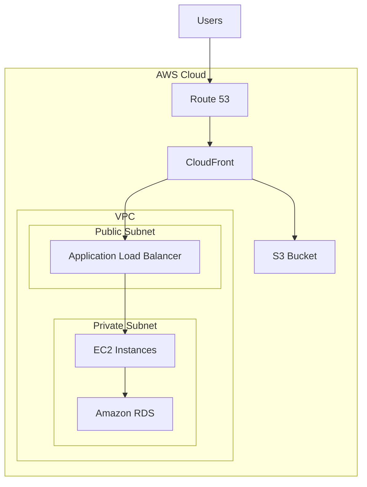

```mermaid
graph TD
    subgraph "AWS Cloud"
        subgraph "VPC"
            subgraph "Public Subnet"
                ALB[Application Load Balancer]
            end
            
            subgraph "Private Subnet"
                EC2[EC2 Instances]
                RDS[Amazon RDS]
            end
        end
        
        S3[S3 Bucket]
        CloudFront[CloudFront]
        Route53[Route 53]
        
        Route53 --> CloudFront
        CloudFront --> S3
        CloudFront --> ALB
        ALB --> EC2
        EC2 --> RDS
    end
    
    Users[Users] --> Route53
```
