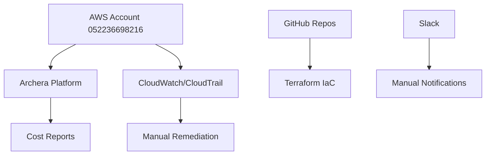
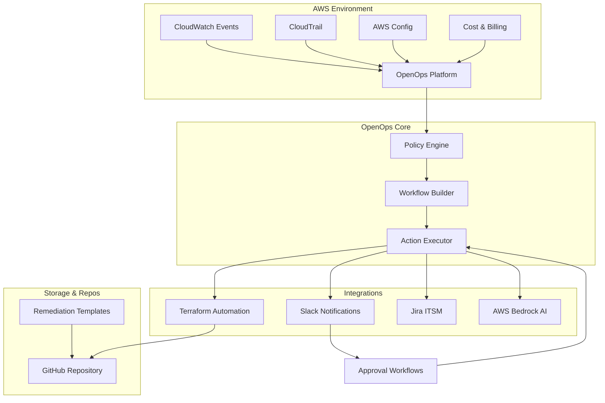
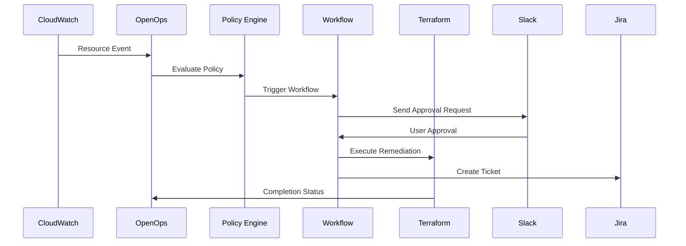

# OpenOps Integration Evaluation - Architecture Documentation

**Project:** OpenOps Integration Evaluation  
**Region:** us-east-1  
**Account:** 052236698216 (Cloudelligent-Production)  
**Duration:** July 7-18, 2025  

## Executive Summary

This document outlines the architecture for evaluating OpenOps as a CloudOps/FinOps automation platform, comparing it against Archera for potential adoption at Cloudelligent.

## 1. Current State Architecture

### Existing Infrastructure
- **Primary Platform:** Archera (current FinOps solution)
- **Cloud Provider:** AWS (us-east-1)
- **Account:** Cloudelligent-Production (052236698216)
- **Repository:** GitHub (cloudelligent organization)
- **Communication:** Slack workspace integration



## 2. Target State Architecture

### OpenOps Integration Design



### Data Flow Architecture



## 3. Migration Strategy and Phases

### Phase 1: Foundation (Days 1-3) - IN PROGRESS
- ✅ OpenOps deployed on i-04216b668db9a2b73
- 🔄 Configure AWS IAM roles and permissions
- ✅ GitHub repository established
- 🔄 Set up basic Slack integration

### Phase 2: Core Integration (Days 4-8)
- Implement 5 priority use cases:
  - Idle EC2 detection/shutdown
  - Unattached EBS cleanup
  - Untagged resource policies
  - Cost threshold alerts
  - Public S3 bucket remediation

### Phase 3: Advanced Features (Days 9-12)
- AWS Bedrock AI integration for rightsizing
- Jira ITSM workflow integration
- Advanced approval workflows via Slack
- Terraform automation templates

### Phase 4: Evaluation (Days 13-14)
- Comparative analysis vs Archera
- Performance and cost assessment
- Final recommendations

## 4. Technology Stack

### Core Components
- **Platform:** OpenOps (open-source)
- **Infrastructure:** AWS EC2 (existing deployment)
- **IaC:** Terraform + CloudFormation
- **Version Control:** GitHub
- **Communication:** Slack + ServiceDesk integration
- **ITSM:** Jira
- **AI/ML:** AWS Bedrock

### Integration APIs
- AWS SDK/CLI
- OpenOps REST API
- Slack Webhooks
- Jira REST API
- GitHub API

## 5. Integration Requirements

### AWS Services Integration
```yaml
Required Permissions:
  - EC2: describe, stop, terminate, modify
  - EBS: describe, delete, create-snapshot
  - S3: list, get-bucket-policy, put-bucket-policy
  - IAM: list, describe (read-only)
  - CloudWatch: describe, put-metric-data
  - Config: describe, put-evaluations
```

### External Integrations
- **Slack:** Webhook URL, Bot token for approvals
- **Jira:** API token, Project keys
- **GitHub:** SSH keys, Repository access
- **Bedrock:** Model access permissions

## 6. Security and Compliance

### IAM Role Structure
```json
{
  "OpenOpsExecutionRole": {
    "AssumeRolePolicyDocument": {
      "Version": "2012-10-17",
      "Statement": [{
        "Effect": "Allow",
        "Principal": {"Service": "ec2.amazonaws.com"},
        "Action": "sts:AssumeRole"
      }]
    },
    "Policies": ["CloudOpsAutomation", "FinOpsRemediation"]
  }
}
```

### Security Controls
- Least privilege access principles
- Approval workflows for destructive actions
- Audit logging via CloudTrail
- Encrypted communication channels
- Secret management via AWS Secrets Manager

## 7. Scalability and Performance

### Current Scope (Pilot)
- Single AWS account (052236698216)
- OpenOps instance: i-04216b668db9a2b73
- 20 use cases maximum
- Manual approval workflows
- Basic notification channels

### Production Scalability
- Multi-account support via cross-account roles
- Automated policy deployment
- High-availability OpenOps deployment
- Load balancing for API endpoints

### Performance Targets
- Event processing: <30 seconds
- Remediation execution: <5 minutes
- Notification delivery: <10 seconds
- Policy evaluation: <15 seconds

## 8. Cost Optimization Opportunities

### OpenOps vs Archera Comparison
| Feature | OpenOps (Open Source) | Archera | Notes |
|---------|----------------------|---------|-------|
| License Cost | $0 | $X/month | Evaluate paid features |
| Automation | High | Medium | Custom workflows |
| AI Integration | Bedrock | Built-in | AWS native vs proprietary |
| Multi-cloud | Limited | Yes | AWS-focused vs multi-cloud |

### Cost Savings Potential
- Automated rightsizing: 15-30% EC2 costs
- Idle resource cleanup: 10-20% overall costs
- Proactive monitoring: Prevent cost spikes
- Policy enforcement: Consistent tagging/governance

## 9. Implementation Checklist

### Pre-requisites ✓
- [x] AWS account access (052236698216)
- [x] OpenOps deployed on i-04216b668db9a2b73
- [x] GitHub repository access
- [ ] Slack workspace integration (in progress)

### Phase 1 Tasks
- [ ] IAM role configuration for i-04216b668db9a2b73
- [ ] Basic policy templates
- [ ] Slack webhook setup
- [ ] Platform connectivity validation
- [ ] Initial use case deployment

### Success Criteria
- 20 use cases successfully implemented
- <5 minute average remediation time
- 95% notification delivery success
- Positive ROI vs Archera comparison

## 10. Risk Assessment

### Technical Risks
- **Open source limitations:** May require paid upgrade
- **Integration complexity:** Multiple API dependencies
- **Performance bottlenecks:** Single EC2 instance deployment

### Mitigation Strategies
- Parallel evaluation of paid features
- Phased integration approach
- Auto-scaling group for production deployment

## Next Steps

1. **Architecture Review:** Team validation by July 9
2. **Pilot Deployment:** Core workflows by July 14
3. **Evaluation Report:** Comparative analysis by July 16
4. **Final Decision:** Go/No-go recommendation by July 18

---

**Document Version:** 1.0  
**Last Updated:** Based on July 7, 2025 kickoff meeting  
**Next Review:** July 9, 2025