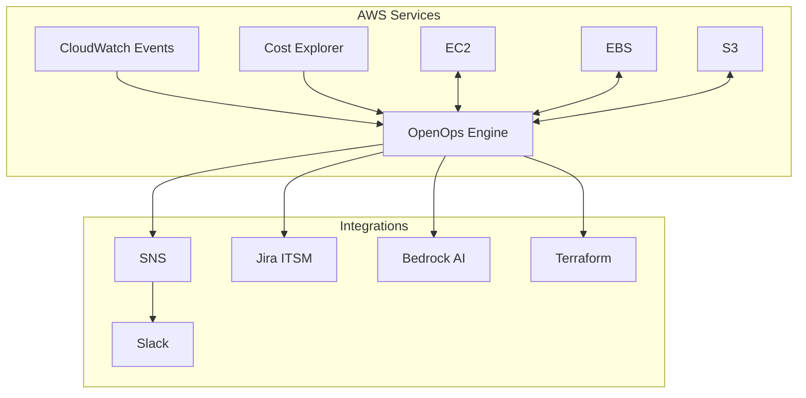

# OpenOps Architecture

**Objective**: Evaluate OpenOps vs Archera | **Timeline**: 14 days | **Account**: 052236698216

## Architecture Overview

## Implementation Status

### Phase 1 Foundation - ✅ COMPLETE
- [x] OpenOps deployed (i-04216b668db9a2b73, t3.large)
- [x] Enhanced IAM permissions (OpenOpsAutomationPolicy)
- [x] AWS integrations validated (EC2, S3, Cost Explorer, CloudWatch)
- [x] CloudWatch Events + SNS configured
- [x] Budget monitoring active ($1000 daily)
- [x] Terraform infrastructure deployed

### Phase 2 Core Use Cases - 🔄 IN PROGRESS
- [ ] Slack webhook integration
- [ ] Idle EC2 detection workflow
- [ ] Cost threshold automation
- [ ] EBS cleanup policies
- [ ] End-to-end testing

## Technology Stack

**Platform**: OpenOps (open-source) on AWS EC2  
**IaC**: Terraform modules  
**Integrations**: Slack, Jira, GitHub, Bedrock AI  
**Monitoring**: CloudWatch Events, SNS, Budget alerts

## Security & Permissions

**IAM Role**: openops-instance-role with OpenOpsAutomationPolicy  
**Permissions**: EC2, EBS, S3, CloudWatch, Cost Explorer, Config, Bedrock  
**Security**: Least privilege, approval workflows, CloudTrail audit

## Performance Targets

- Event processing: <30 seconds
- Remediation execution: <5 minutes  
- Notification delivery: <10 seconds
- 95% automation success rate

## Cost Comparison

| Feature | OpenOps | Archera |
|---------|---------|---------|
| License | $0 (open source) | Paid |
| Automation | High (custom) | Medium |
| AI Integration | AWS Bedrock | Built-in |
| Multi-cloud | AWS-focused | Yes |

**Expected Savings**: 15-30% through automated rightsizing and cleanup

## Next Steps

**Phase 2**: Implement core use cases and Slack integration  
**Phase 3**: Advanced AI and ITSM workflows  
**Phase 4**: Final evaluation and decision by July 18, 2025