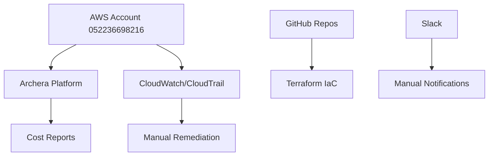
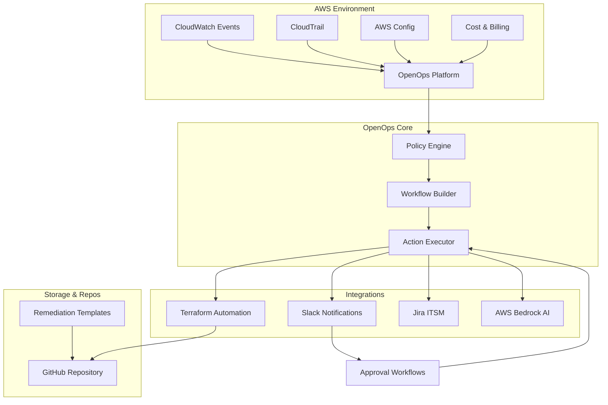
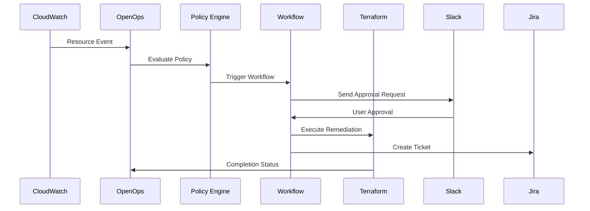

# OpenOps Integration Evaluation - Architecture Documentation

**Project:** OpenOps Integration Evaluation  
**Region:** us-east-1  
**Account:** 052236698216 (Cloudelligent-Production)  
**Duration:** July 7-18, 2025  

## Executive Summary

This document outlines the architecture for evaluating OpenOps as a CloudOps/FinOps automation platform, comparing it against Archera for potential adoption at Cloudelligent.

## 1. Current State Architecture

### Existing Infrastructure
- **Primary Platform:** Archera (current FinOps solution)
- **Cloud Provider:** AWS (us-east-1)
- **Account:** Cloudelligent-Production (052236698216)
- **Repository:** GitHub (cloudelligent organization)
- **Communication:** Slack workspace integration

## 2. Target State Architecture

### OpenOps Integration Design

### Data Flow Architecture

## 3. Migration Strategy and Phases

### Phase 1: Foundation (Days 1-3) - IN PROGRESS
- ✅ OpenOps deployed on i-04216b668db9a2b73
- 🔄 Configure AWS IAM roles and permissions
- ✅ GitHub repository established
- 🔄 Set up basic Slack integration

### Phase 2: Core Integration (Days 4-8)
- Implement 5 priority use cases:
  - Idle EC2 detection/shutdown
  - Unattached EBS cleanup
  - Untagged resource policies
  - Cost threshold alerts
  - Public S3 bucket remediation

### Phase 3: Advanced Features (Days 9-12)
- AWS Bedrock AI integration for rightsizing
- Jira ITSM workflow integration
- Advanced approval workflows via Slack
- Terraform automation templates

### Phase 4: Evaluation (Days 13-14)
- Comparative analysis vs Archera
- Performance and cost assessment
- Final recommendations

## Technology Stack

**Platform**: OpenOps (open-source) on AWS EC2  
**IaC**: Terraform modules  
**Integrations**: Slack, Jira, GitHub, Bedrock AI  
**Monitoring**: CloudWatch Events, SNS, Budget alerts

## Security & Permissions

**IAM Role**: openops-instance-role with OpenOpsAutomationPolicy  
**Permissions**: EC2, EBS, S3, CloudWatch, Cost Explorer, Config, Bedrock  
**Security**: Least privilege, approval workflows, CloudTrail audit

## Performance Targets

- Event processing: <30 seconds
- Remediation execution: <5 minutes  
- Notification delivery: <10 seconds
- 95% automation success rate

## Cost Comparison

| Feature | OpenOps | Archera |
|---------|---------|---------|
| License | $0 (open source) | Paid |
| Automation | High (custom) | Medium |
| AI Integration | AWS Bedrock | Built-in |
| Multi-cloud | AWS-focused | Yes |

**Expected Savings**: 15-30% through automated rightsizing and cleanup

## Next Steps

**Phase 2**: Implement core use cases and Slack integration  
**Phase 3**: Advanced AI and ITSM workflows  
**Phase 4**: Final evaluation and decision by July 18, 2025