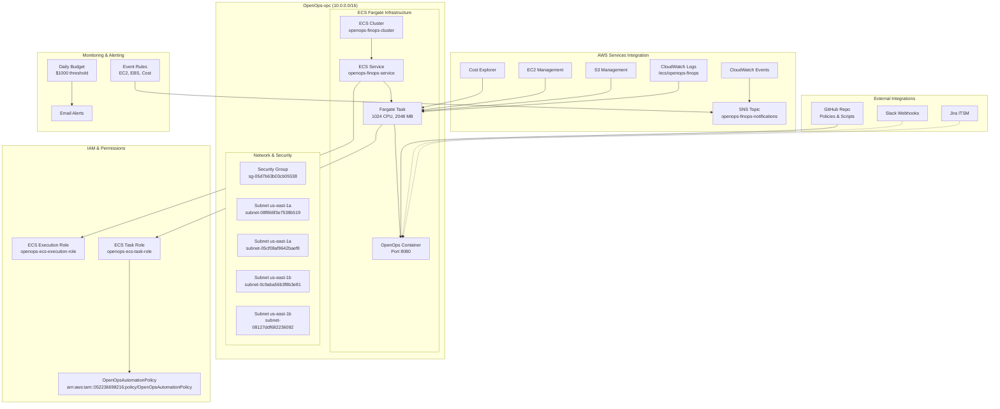

# OpenOps ECS Architecture - Deployed Infrastructure

**Deployment**: ✅ COMPLETE | **Account**: 052236698216 | **Region**: us-east-1

## Architecture Overview



## Deployed Resources

### **ECS Infrastructure**
- **Cluster**: `openops-finops-cluster` (Fargate)
- **Service**: `openops-finops-service` (1 task desired)
- **Task Definition**: `openops-finops:1` (1024 CPU, 2048 MB)
- **Container**: Amazon Linux 2 with OpenOps, AWS CLI, SSM Agent

### **Networking**
- **VPC**: `vpc-00bdf7ab7f4ef7ba8` (OpenOps-vpc, 10.0.0.0/16)
- **Subnets**: 4 private subnets across us-east-1a and us-east-1b
- **Security Group**: `sg-05d7b63b03cb05538` (port 8080 ingress)
- **Public IP**: Enabled for container image pulls

### **IAM Roles & Policies**
- **Task Role**: `openops-ecs-task-role` (AWS service permissions)
- **Execution Role**: `openops-ecs-execution-role` (ECS + SSM permissions)
- **Policy**: `OpenOpsAutomationPolicy` (EC2, S3, Cost Explorer, etc.)

### **Monitoring & Events**
- **CloudWatch Events**: EC2 state changes, EBS events, cost anomalies
- **SNS Topic**: `openops-finops-notifications`
- **Budget**: `openops-daily-budget` ($1000 daily threshold)
- **Logs**: `/ecs/openops-finops` (7-day retention)

## Container Capabilities

### **Startup Process**
1. Install dependencies (Python3, AWS CLI, SSM Agent, Git)
2. Clone GitHub repo for policies and test scripts
3. Setup OpenOps directory structure
4. Start OpenOps HTTP server on port 8080

### **API Endpoints**
- `GET /health` - Health check
- `GET /api/status` - Service status
- `GET /policies/` - List available policies
- `GET /policies/{policy-name}` - Get specific policy

### **Remote Access**
```bash
# Connect to running container
aws ecs execute-command --cluster openops-finops-cluster \
  --task 9cd63f5f411c4483a176cc517051bf42 \
  --interactive --command "/bin/bash"
```

## Current Status

**✅ Deployment Complete**
- ECS cluster active with 1 service
- Task starting (pendingCount: 1)
- All IAM roles and policies created
- CloudWatch Events and SNS configured
- Budget monitoring active

**🔄 Next Steps**
1. Verify container startup and health
2. Test OpenOps API endpoints
3. Validate AWS permissions from task
4. Configure Slack webhook integration
5. Begin Phase 2 use case implementation

## Performance & Scaling

**Current Configuration**:
- 1 Fargate task (1024 CPU, 2048 MB memory)
- Auto-scaling: Not configured (evaluation phase)
- Health checks: Container port 8080
- Restart policy: ECS managed

**Production Considerations**:
- Enable auto-scaling based on CPU/memory
- Add Application Load Balancer for high availability
- Configure service discovery for internal access
- Implement blue/green deployments